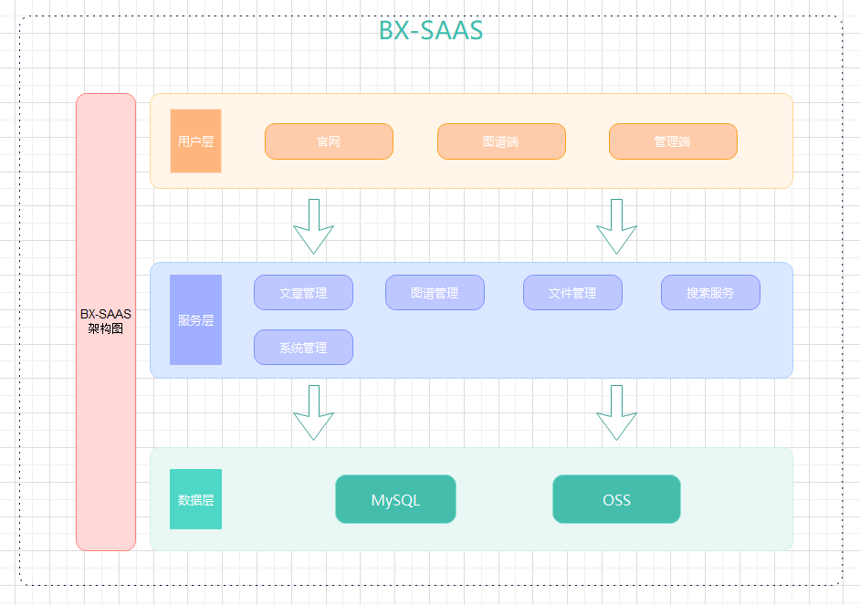

# 概览

BX-SAAS 项目相关文档

## 架构图

## 技术

### 前端
Vue3 + Element-Plus + Sass

### 官网
Vue3 + Nuxt + Sass

### 后端
Python3.10.8 + FastAPI

### 存储
MySQL + OSS

### 部署
Linux + Docker + Docker Compose

### 文档
Python3.10.8 + MkDocs + Markdown

### 代码管理
Git + Gitee

## 参考
+ [MkDocs](https://www.mkdocs.org/)
+ [Virtualenv](https://virtualenv.pypa.io/en/latest/index.html)
+ [FastAPI](https://fastapi.tiangolo.com/zh/)
+ [Neo4j](https://neo4j.com/)
+ [Neo4j Python Driver Manual](https://neo4j.com/docs/python-manual/current/)

+ [Vue3](https://cn.vuejs.org/)
+ [Vite](https://cn.vitejs.dev/)
